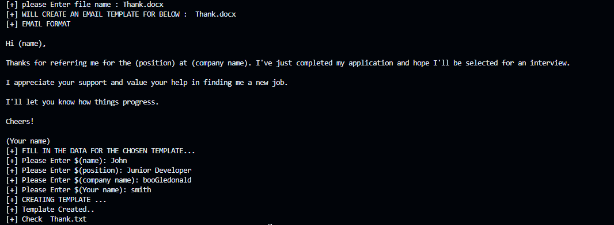

# Email Template Generator

The **Email Template Generator** is a simple Python program that allows users to choose from a set of predefined email templates, fill in the necessary details, and then generate a template.txt file containing the filled-out email. This tool is designed to streamline the process of composing repetitive emails while ensuring consistency and accuracy.


## Screenshots

1. **APP IMAGE**




## Features

- Choose from a selection of predefined email templates.
- Fill in specific fields within the chosen template, such as recipient name, subject, and content.
- Generate a template.txt file containing the completed email that users can easily copy and paste.
- Simplify the process of composing repetitive emails by using predefined templates.

## Getting Started

1. **Clone the Repository:** Begin by cloning this repository to your local machine using the following command:

   ```
   git clone https://github.com/bk201grsameer/Email_Generator.git
   ```

2. **Navigate to the Directory:** Move into the project directory:

   ```
   cd Email_Generator
   ```

3. **Run the Program:** Execute the Python script to start the Email Template Generator:

   ```
   python program.py
   ```

## How to Use

1. Upon running the program, you will be presented with a list of available email templates to choose from.

2. Select the desired template by entering the corresponding template number.

3. Follow the prompts to fill in the required information for the email template, such as recipient name, subject, and content.

4. Once all the necessary fields are filled in, the program will generate a template.txt file in the same directory.

5. Open the generated template.txt file using a text editor.

6. Copy the content of the template.txt file and paste it into your email client to send the email.

## Adding or Modifying Templates

To add or modify email templates, follow these steps:

1. Open the `email_templates.py` file in a text editor.

2. To add a new template, create a dictionary with the necessary template information. The dictionary should have the following structure:

   ```python
   {
       'name': 'Template Name',
       'subject': 'Subject Line',
       'content': 'Email Content\nYou can use line breaks.'
   }
   ```

3. Add the newly created dictionary to the `EMAIL_TEMPLATES` list.

4. Save the `email_templates.py` file.

## Dependencies

The Email Template Generator requires Python 3.x to run. There are no additional external dependencies.

## Contributing

Contributions are welcome! If you'd like to add new features, improve existing functionality, or fix issues, feel free to submit a pull request.

## License

This project is licensed under the [MIT License](LICENSE).

---

Happy emailing! If you have any questions or feedback, please don't hesitate to contact us at your@email.com.